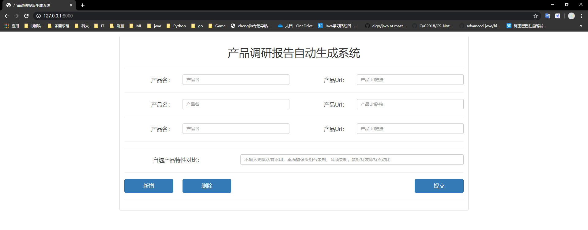
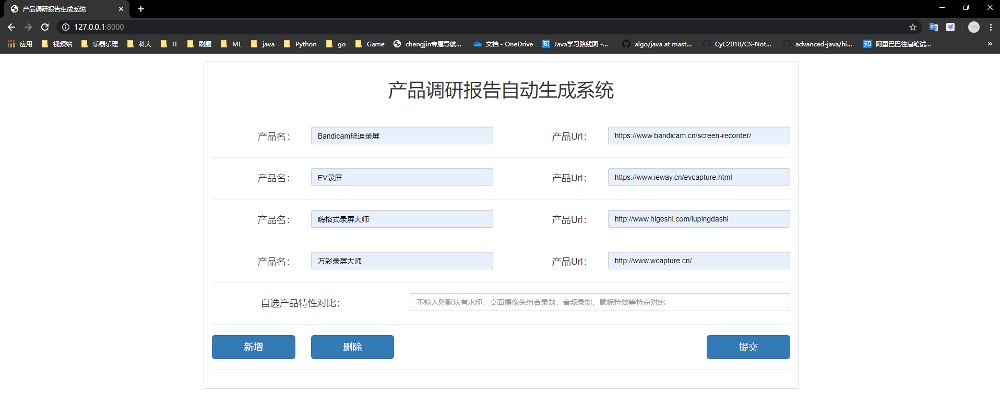
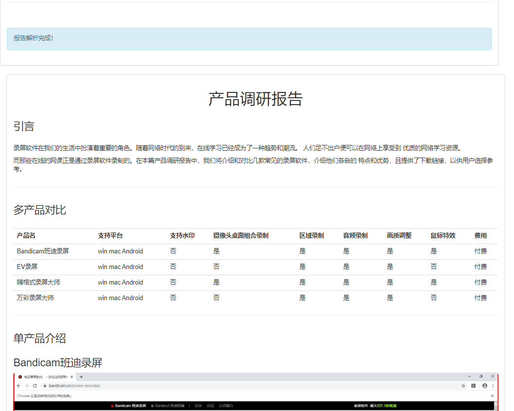
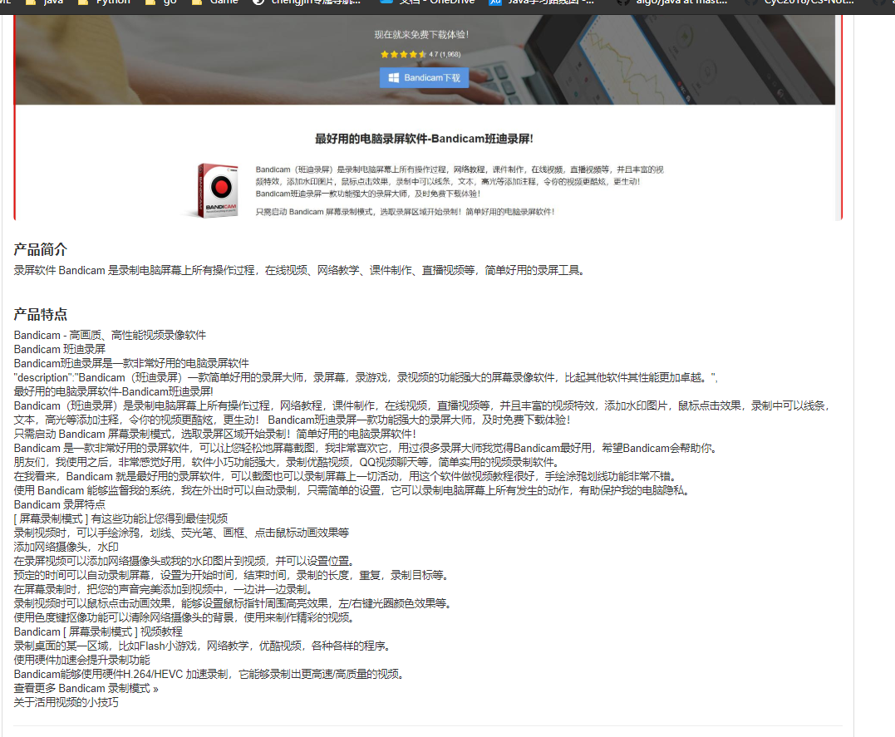
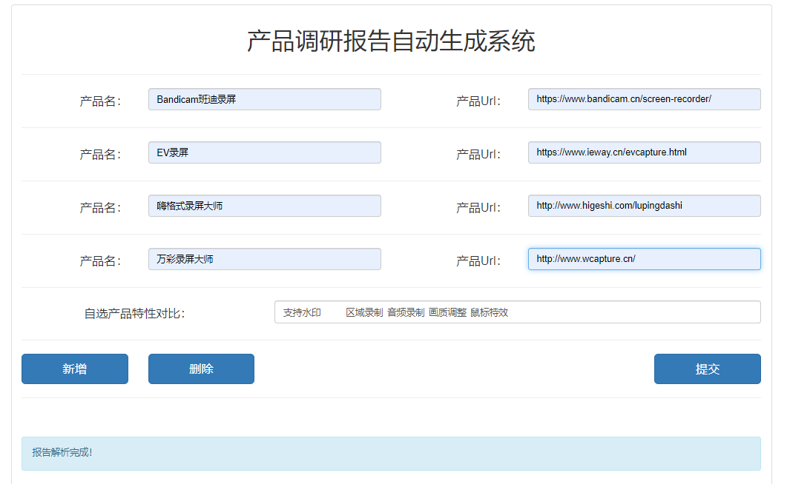
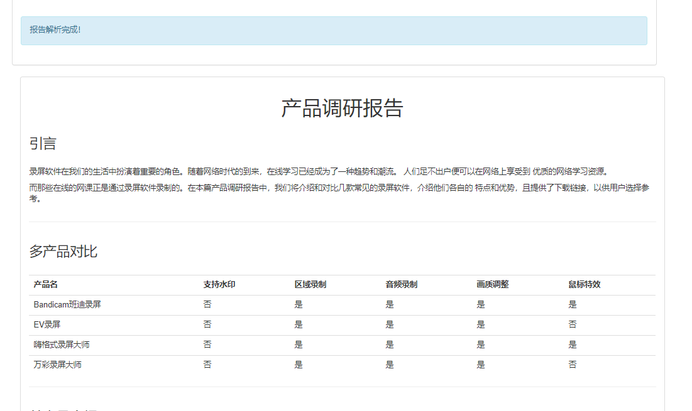

## 录屏软件调研报告生成系统

基于Django搭建的Web平台，

需要的用户输入：

- 产品名字
- 产品URL
- 想在产品之间做对比的特性

系统在后台进行爬虫，语句提取。综合整理成一篇调研报告，给出网页上的展示和word版本的下载（word版本下载暂时为实现）。

目前版本v 0.0.3


**仍待优化的问题**

- 产品特性对比中，筛选算法比较简单，准确率无法达到100%
- 文本生成中，筛选算法比较简单， 内容相关性不如预期的高

---

## 版本迭代

### v 0.0.1

**初始界面展示（注意是index目录）**


**用户进行输入，然后提交，特性暂时采用默认**


**展示结果**


系统生成的报告是粗糙的，需要经过人工二次审校放能使用。（V 0.0.1）


---

### v 0.0.2

新增功能：首次访问目标产品网址时，使用selenium+tkinter 完成截取系统官网屏幕截图，并缓存，再放置到报告当中。再次访问时无需再次截取。

效果图如下：


---

---

### v 0.0.3

对界面进行部分CSS美化，用户可以输入和录屏软件相关的自定义特性。

特性仅限于以下

```
支持平台，支持水印，摄像头桌面组合录制，区域录制，音频录制，画质调整，鼠标特效，费用，付费
```

**界面**



**默认特性对比**








**自选特性对比**



