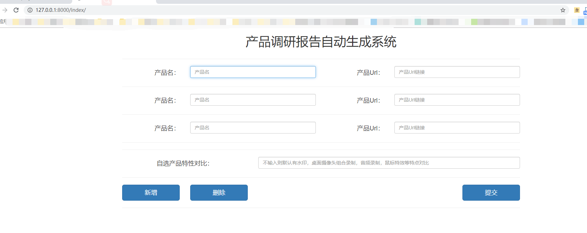
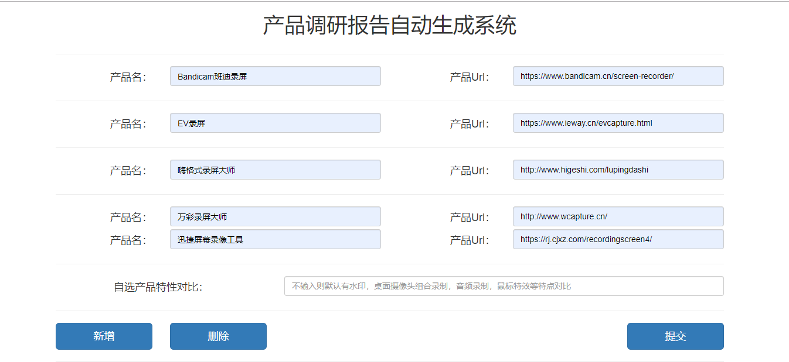
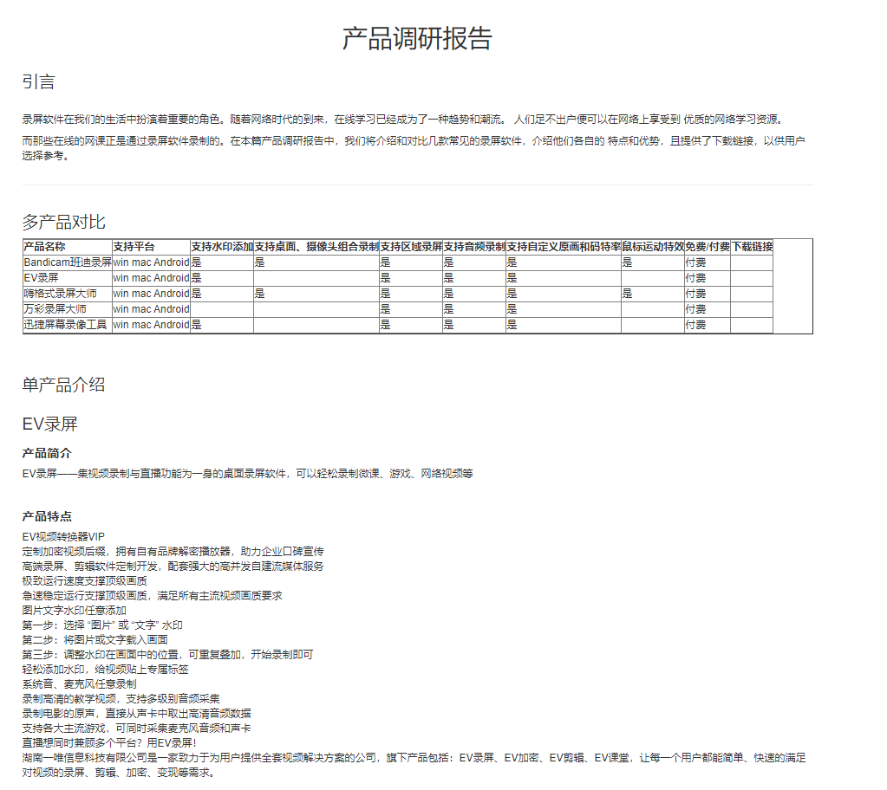
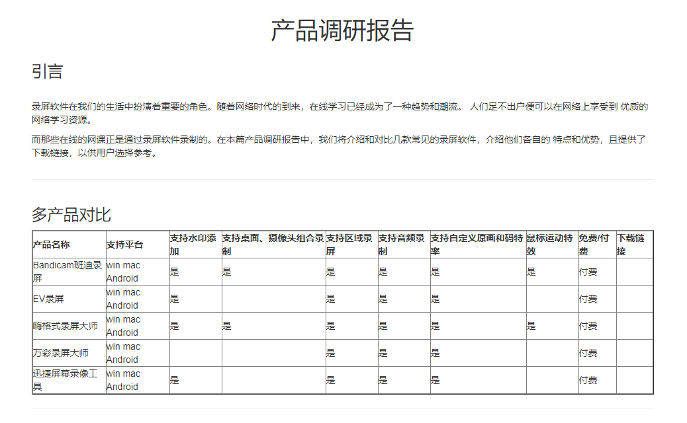
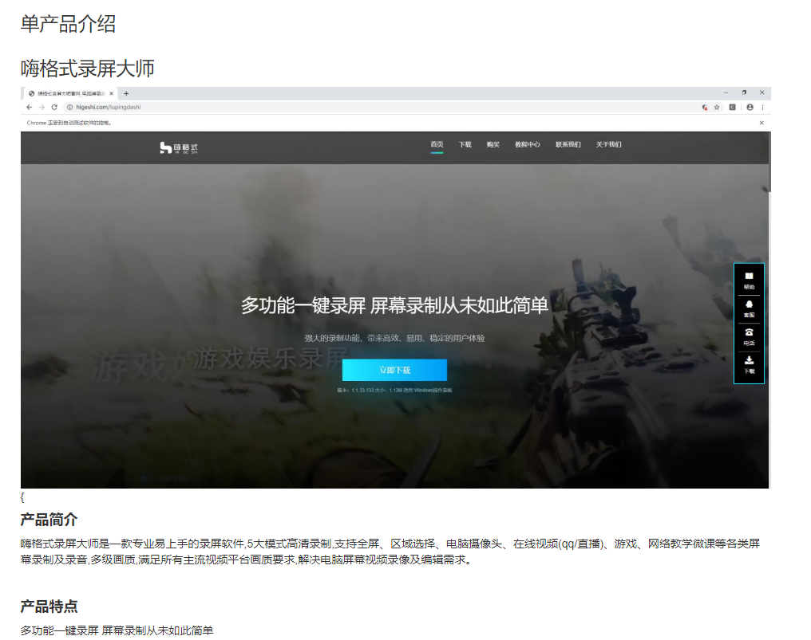

## 录屏软件调研报告生成系统

基于Django搭建的Web平台，

需要的用户输入：

- 产品名字
- 产品URL
- 想在产品之间做对比的特性

系统在后台进行爬虫，语句提取。综合整理成一篇调研报告，给出网页上的展示和word版本的下载（word版本下载暂时为实现）。

**初始界面展示（注意是index目录）**

**用户进行输入，然后提交，特性暂时采用默认**

**展示结果**

系统生成的报告是粗糙的，需要经过人工二次审校放能使用。（V 0.0.1）
<<<<<<< HEAD

---

**更新-V 0.0.2**

1. 使用selenium+tkinter 完成截取系统官网屏幕截图，用于放置到报告当中。

效果图如下：

=======
>>>>>>> 40b43e20b11ebe8a940271360055ca6e1a5ff495
